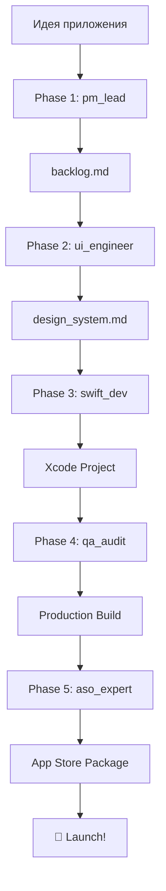

# 🏭 Fabrika - Mobile App Factory

Автоматизированная разработка iOS-приложений с помощью multi-agent workflow, работающего на Claude Code и Axiom skills.

## Что такое Fabrika?

Fabrika — это multi-agent система, которая берёт идею приложения и создаёт полное, готовое к App Store iOS-приложение через структурированный 5-фазный workflow.

```
Идея приложения
    ↓
Phase 1: pm_lead → backlog.md
    ↓
Phase 2: ui_engineer → design_system.md
    ↓
Phase 3: swift_dev → Xcode Project
    ↓
Phase 4: qa_audit → Production Build + Tests
    ↓
Phase 5: aso_expert → App Store Package
    ↓
Готово к публикации! 🚀
```

## Агенты

### 🎯 pm_lead - Product Marketing Manager
Анализирует конкурентов, создаёт требования, приоритизирует функции по MoSCoW методу.

**Результат:** `backlog.md` с детальными требованиями и user stories

### 🎨 ui_engineer - SwiftUI Designer
Создаёт дизайн-систему, Liquid Glass компоненты, обеспечивает HIG соответствие.

**Результат:** `design_system.md` с компонентами и спецификациями экранов

**Axiom Skills:** axiom-liquid-glass, axiom-swiftui-26-ref, accessibility-debugging

### 💻 swift_dev - Swift Developer
Реализует приложение на Swift 6, SwiftUI, SwiftData с современными concurrency паттернами.

**Результат:** Полный Xcode проект

**Axiom Skills:** axiom-swift-concurrency, axiom-swiftdata, axiom-swiftui-performance, axiom-liquid-glass

### ✅ qa_audit - QA Engineer
Тестирование, аудит memory/accessibility/performance, исправление багов.

**Результат:** Production-ready build + test suite + audit reports

**Axiom Skills:** axiom-memory-debugging, accessibility-debugging, axiom-ui-testing

**Commands:** `/prescan-memory`, `/audit-accessibility`, `/audit-liquid-glass`

### 📱 aso_expert - ASO Specialist
Оптимизация App Store, подготовка metadata, screenshots, стратегия запуска.

**Результат:** App Store submission package

## Quick Start

```bash
# 1. Запустите фабрику с идеей приложения
./factory.sh start "Создай meditation app как Calm"

# 2. Фабрика автоматически проведёт через 5 фаз:
# Phase 1: Research → backlog.md
# Phase 2: Design → design_system.md
# Phase 3: Build → Xcode project
# Phase 4: Hard Audit → Tests & fixes
# Phase 5: Delivery → App Store package

# 3. Отправьте в App Store! 🎉
```

## Режимы Работы

### 📂 Локальные Проекты (по умолчанию)
```bash
./factory.sh start "Fitness app" --local
# Создаст: fabrika/projects/FitnessApp/
```

### 📦 Отдельный Репозиторий
```bash
./factory.sh start "Recipe app" --repo /home/user/RecipeApp
# Создаст: /home/user/RecipeApp/ (новый git repo)
```

### 📝 Существующий Проект
```bash
cd /path/to/existing/project
/path/to/fabrika/factory.sh swift_dev --existing
```

## Возможности

- 🤖 **AI-driven workflow** - 5 специализированных агентов
- 🎨 **Liquid Glass** - Современный iOS 26 дизайн
- ⚡ **Swift 6** - Strict concurrency, actors, async/await
- ♿ **Accessibility-first** - WCAG AA compliance
- 🔍 **Quality Assurance** - Comprehensive testing & auditing
- 📱 **ASO** - App Store optimization
- 🔄 **Seamless Handoffs** - Чёткие переходы между фазами

## Установка

### Prerequisites

1. **Claude Code CLI**
   ```bash
   # Установите Claude Code: https://claude.ai/code
   ```

2. **Axiom Skills**
   ```bash
   claude code
   # В Claude Code:
   /plugin marketplace add CharlesWiltgen/Axiom
   ```

3. **Xcode 15.0+** (для разработки iOS)

### Setup

```bash
# Clone репозиторий
git clone <repository-url>
cd fabrika

# Готово! Можно использовать
./factory.sh help
```

## Использование

### Полный Pipeline

```bash
# Запустить все 5 фаз последовательно
./factory.sh start "Your app idea"
```

### Отдельные Фазы

```bash
# Phase 1: Research
./factory.sh pm_lead --input "Build a recipe app like Tasty"

# Phase 2: Design
./factory.sh ui_engineer

# Phase 3: Build
./factory.sh swift_dev

# Phase 4: Audit
./factory.sh qa_audit

# Phase 5: Delivery
./factory.sh aso_expert
```

### Утилиты

```bash
# Показать статус фабрики
./factory.sh status

# Список всех проектов
./factory.sh list

# Помощь
./factory.sh help
```

## Архитектура

### Workflow



### Структура Файлов

```
fabrika/
├── .factory/
│   ├── agents/           # Инструкции для агентов
│   │   ├── pm_lead.md
│   │   ├── ui_engineer.md
│   │   ├── swift_dev.md
│   │   ├── qa_audit.md
│   │   └── aso_expert.md
│   ├── templates/        # Шаблоны документов
│   ├── examples/         # Примеры workflow
│   └── handoffs/         # Документы передачи между фазами
├── projects/             # Локальные проекты (опционально)
├── factory.sh            # CLI инструмент
├── README.md             # Этот файл
└── README_RUN.md         # Детальное руководство
```

## Примеры

### Meditation App
```bash
./factory.sh start "Create a meditation app similar to Calm with guided sessions, progress tracking, and daily reminders"
```

**Результат:**
- ✅ Backlog с анализом Calm, Headspace, Insight Timer
- ✅ Liquid Glass дизайн-система с успокаивающими цветами
- ✅ SwiftUI app с SwiftData для прогресса
- ✅ Full VoiceOver support, Dynamic Type
- ✅ App Store listing готов

### Fitness Tracker
```bash
./factory.sh start "Fitness tracking app with workouts, nutrition, and HealthKit integration" --repo ~/FitnessTracker
```

**Результат:**
- ✅ HealthKit integration
- ✅ Charts для визуализации прогресса
- ✅ Performance optimized (60fps scrolling)
- ✅ CloudKit sync между устройствами

## Axiom Skills Integration

Fabrika интегрируется с [Axiom](https://github.com/CharlesWiltgen/Axiom) — battle-tested skills для iOS разработки:

- **axiom-liquid-glass** - iOS 26 material design system
- **axiom-swift-concurrency** - Swift 6 concurrency patterns
- **axiom-swiftdata** - SwiftData best practices
- **axiom-swiftui-performance** - SwiftUI optimization
- **axiom-memory-debugging** - Memory leak detection
- **accessibility-debugging** - WCAG compliance

### Audit Commands

Во время QA фазы автоматически запускаются:

```bash
/prescan-memory          # Memory leak detection
/audit-accessibility     # WCAG AA compliance check
/audit-liquid-glass      # Material usage validation
```

## Quality Standards

Каждое приложение, созданное фабрикой:

- ✅ **Swift 6 compliant** - Strict concurrency enabled
- ✅ **>70% test coverage** - Unit + UI tests
- ✅ **WCAG AA accessible** - Full VoiceOver support
- ✅ **Zero memory leaks** - Validated with Instruments
- ✅ **<2s launch time** - Performance profiled
- ✅ **60fps scrolling** - Smooth animations
- ✅ **Dark Mode** - Full support
- ✅ **No warnings** - Clean builds

## Roadmap

- [x] Phase 1: pm_lead agent
- [x] Phase 2: ui_engineer agent
- [x] Phase 3: swift_dev agent
- [x] Phase 4: qa_audit agent
- [x] Phase 5: aso_expert agent
- [x] factory.sh CLI tool
- [ ] Android support (Kotlin, Jetpack Compose)
- [ ] Cross-platform (React Native, Flutter)
- [ ] Автоматический CI/CD setup
- [ ] Automated App Store submission

## Поддержка

- **Axiom Documentation**: https://github.com/CharlesWiltgen/Axiom
- **Claude Code**: https://claude.ai/code
- **Apple HIG**: https://developer.apple.com/design/human-interface-guidelines/
- **Swift**: https://swift.org/documentation/

## Contributing

Contributions welcome! Please:

1. Fork the repository
2. Create a feature branch
3. Make your changes
4. Submit a pull request

## License

MIT License - see LICENSE file for details

---

**Создано с помощью Claude Code и Axiom** 🏭

*Fabrika - От идеи до App Store за считанные часы* 🚀
